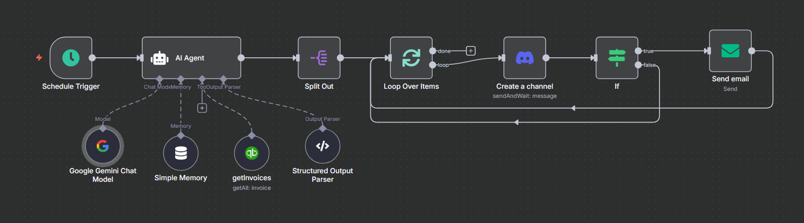

# 🧾 Agentic AI for Overdue Invoice Reminders  

This project is an **AI-powered collections assistant** built on **n8n**.  
It integrates **QuickBooks Online**, **Google Gemini**, **Discord**, and **Email** to help shops automatically manage overdue invoices and send polite payment reminders — with shop-owner approval before sending.  

---

## 🚀 Features  
- ⏰ **Weekly Automation** – Runs on a schedule to check overdue invoices.  
- 📊 **QuickBooks Integration** – Fetches all invoices and filters only those past their due date.  
- 🤖 **AI Analysis (Google Gemini)** – Drafts professional reminder messages.  
- 🛠 **Human-in-the-loop** – Sends reminders to Discord for shop owner review (approve/decline).  
- 📧 **Email Reminders** – Automatically emails customers if approved.  
- 💼 **Business Friendly** – Saves time, improves cash flow, and maintains professionalism.  

---

## ⚙️ Workflow Overview  

1. **Schedule Trigger** → Starts automation weekly.  
2. **Fetch Invoices** → QuickBooks (`getInvoices`) retrieves invoice data.  
3. **AI Agent** → Google Gemini analyzes invoices, selects overdue ones, drafts reminders.  
4. **Split & Loop** → Each overdue invoice is processed individually.  
5. **Discord Approval** → Shop owner reviews draft reminder.  
   - ✅ Approve → Send email reminder to customer.  
   - ❌ Decline → Skip sending.  
6. **Email Delivery** → Customers receive a professional payment reminder.  

---

## 🖼 Workflow Diagram  
  
*(Replace with your actual screenshot path or export from n8n)*  

---

## 🛠 Requirements  

- [n8n](https://n8n.io/) (self-hosted or cloud)  
- QuickBooks Online account (with API access)  
- Discord server (for approvals)  
- Email SMTP setup (for sending reminders)  
- Google Gemini API key (for AI agent)  

---

## 🔑 Setup  

1. **Clone Repository**  
   ```bash
   git clone https://github.com/your-username/agentic-ai-invoice-reminder.git
   cd agentic-ai-invoice-reminder
   ```  

2. **Import Workflow in n8n**  
   - Open n8n dashboard  
   - Import JSON workflow file from this repo  

3. **Configure Environment Variables**  
   ```env
   QUICKBOOKS_API_KEY=your_quickbooks_api_key
   DISCORD_WEBHOOK_URL=your_discord_webhook
   EMAIL_SMTP_HOST=smtp.yourmail.com
   EMAIL_SMTP_USER=your_email
   EMAIL_SMTP_PASS=your_password
   GEMINI_API_KEY=your_gemini_api_key
   ```  

4. **Deploy**  
   - Start n8n workflow  
   - Project runs weekly and manages overdue invoices automatically  

---

## 📧 Example Flow  

- Invoice due on **2025-09-01** not paid  
- Weekly run detects overdue invoice  
- AI drafts polite reminder:  
  *"Dear Customer, our records show invoice #123 is overdue. Kindly complete payment at your earliest convenience."*  
- Discord message asks owner for approval  
- If approved → Email is sent to customer  

---

## 📌 Use Cases  

- 🏪 **Shops & Small Businesses** – Manage customer payments  
- 📑 **Freelancers** – Send professional reminders to clients  
- 🏦 **Agencies** – Ensure steady cash flow with minimal effort  

---

## 📜 License  

This project is licensed under the MIT License – see the [LICENSE](LICENSE) file for details.  

---

👉 With this, any shop can **automate overdue invoice reminders** while keeping full control over customer communication.  
